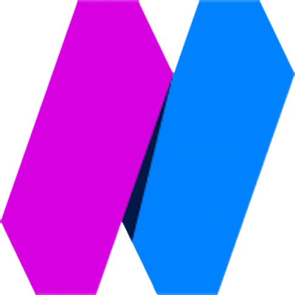

<h1 align="center"><i>Full-stack Rust & Blockchain Developer</i></h1>
 

Seasoned Full-Stack Rust & Blockchain Developer specializing in Rust programming language and Blockchain technologies. With extensive experience in Ethereum, Solana, Internet Computer, and Cosmos blockchains, I have successfully developed 15+ dApps and smart contracts. My expertise spans a wide range of blockchain applications, including NFT marketplaces, staking platforms, gambling, betting, P2P games, dice, coin flip mechanisms.

Experience developing several web applications, backend APIs, CLI tools and desktop applications using Rust, C/C++, Python, Golang, Node.js and JavaScript/TypeScript. Deep understanding of several system-level languages such as Rust, C/C++ and Golang. Rich knowledge of data structures and algorithms such as AVL tree, BST, TST, BIT(Fenwick tree), RMQ(Tournament Tree), Segment tree, Suffix array, Dynamic programming, Sorting algorithm, Greedy algorithm, Graph theory, Traveling Salesman Problem etc.

Currently, I am working as Rust Dev at <a href="https://nobleblocks.com">@NobleBlocks</a>

 
<h2 align="center">backend</h4>

  <picture>
    
  </picture>

 
<h2 align="center">frontend</h4>

  <picture>
    
  </picture>

 
<h2 align="center">database</h4>

  <picture>
    
  </picture>

